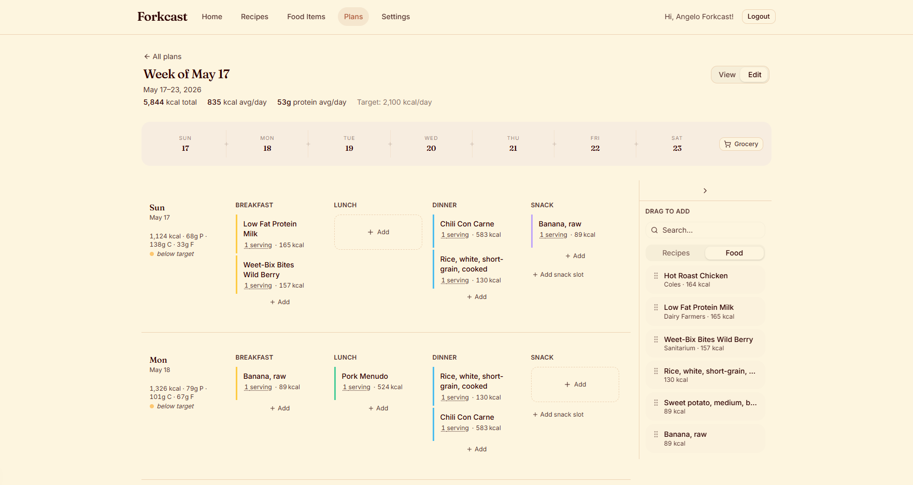
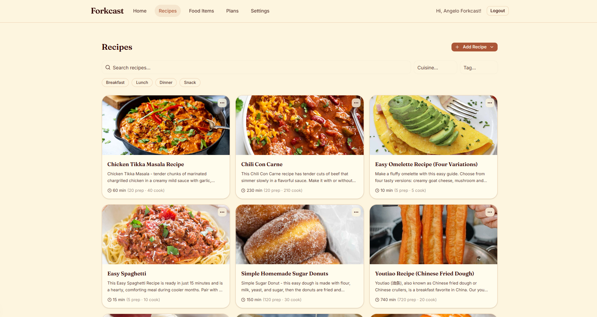
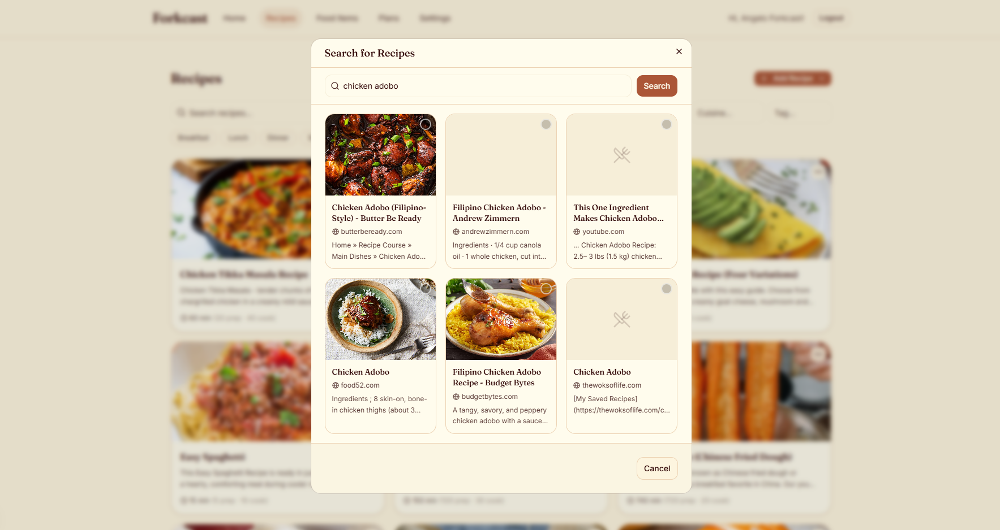
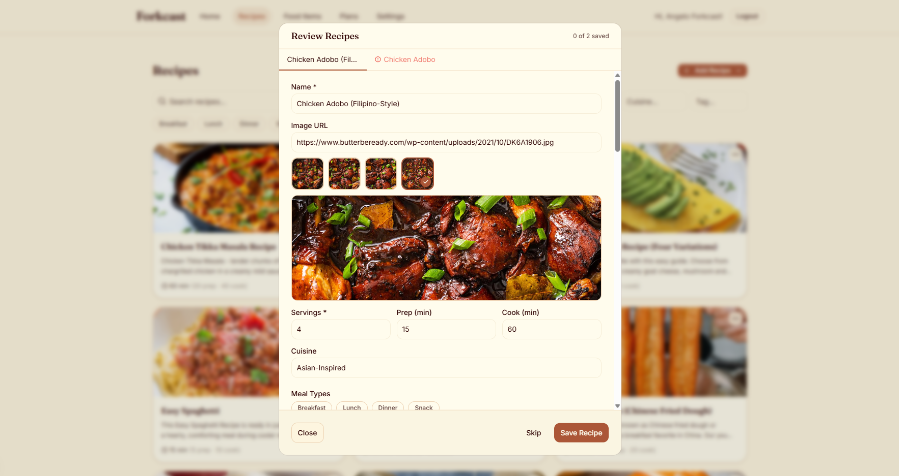
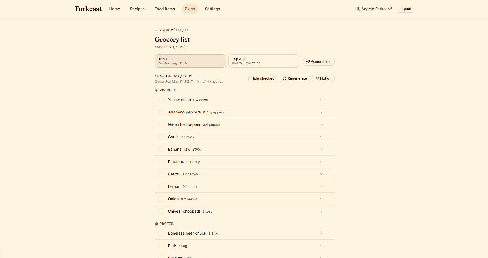

# Forkcast

A personal weekly meal planner. Build a 7-day plan from your own recipe bank, track macros against daily targets, and let AI do the tedious work of importing recipes from the web.


## What it does

- **Recipe bank** — save recipes manually or import them straight from a URL. AI reads the page and fills in ingredients, macros, and instructions for you.
- **Web search** — search for recipes by name or cuisine and pick from results without leaving the app.
- **Weekly planner** — drag recipes into a 7-day grid across breakfast, lunch, dinner, and snacks.
- **Macro tracking** — set daily targets and see how each day stacks up as you fill the plan.
- **Grocery list** — generate a shopping list from the week's plan, with optional Notion export.

## Screenshots

### Weekly planner


### Recipe bank


### Importing a recipe

  

### Grocery list


## Running locally

### Prerequisites

- Node 24
- A [Supabase](https://supabase.com) project
- An [Anthropic](https://console.anthropic.com) API key
- Optionally, a [Tavily](https://tavily.com) API key for faster recipe search

### 1. Install dependencies

```bash
npm install
```

### 2. Set up environment variables

Copy the example file and fill in your keys:

```bash
cp .env.example .env.local
```

| Variable | Where to get it |
|---|---|
| `NEXT_PUBLIC_SUPABASE_URL` | Supabase project → Settings → API |
| `NEXT_PUBLIC_SUPABASE_PUBLISHABLE_KEY` | Same page, "publishable" key |
| `SUPABASE_SECRET_KEY` | Same page, "secret" key |
| `ANTHROPIC_API_KEY` | [console.anthropic.com](https://console.anthropic.com) → API Keys |
| `RECIPE_SEARCH_PROVIDERS` | Comma-separated priority list — e.g. `tavily,claude` or just `claude` |
| `TAVILY_API_KEY` | [tavily.com](https://tavily.com) (optional, for faster search) |

### 3. Push the database schema

```bash
npx supabase db push
```

This applies the migrations in `supabase/migrations/` to your Supabase project.

### 4. Start the dev server

```bash
npm run dev
```

Open [http://localhost:3000](http://localhost:3000).
